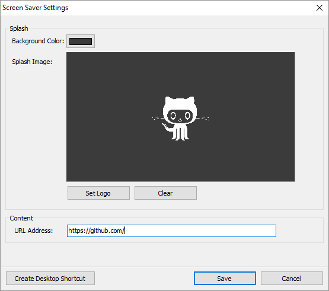

# ScreensaverKit

## About

ScreensaverKit is a screensaver toolkit written in Delphi, that supports easily building screensavers for Windows platform.

## Features

* Multi monitor support (duplicates across all monitors)
* Provides hotkey binding internally
* Provides settings supports for options persistence
* Supports building screensavers for Windows 10 platform
* True screensaver mode (hide taskbar, full screen, etc.)
* Single instance checks to disallow screensaver from running more than once
* Mouse and keyboard detection to exit the screensaver has been optimized
* Handling external changes to screensaver screen(s)

## Example

* Supports IE rendering engine
* Customizable URL
* Customizable splash background color and logo (default is black without logo)
* Hotkey binding to start screensaver (Achieved by accessing the screensavers settings, and clicking on create shortcut, which creates a desktop shortcut binded to the hotkey Ctrl+Alt+L)
* An indefinite progress bar that reacts to normal and erroneous url loading
* Support for JPG logos
* Made embedded IE chromeless (no scrollbars, no borders, no clickable content)

## Requirements

Some examples utilize modules from _Project JEDI_, therefore you must have the following libraries installed into your Delphi development environment.

* [JEDI Code Library](https://github.com/project-jedi/jcl/)
* [JEDI Visual Component Library](https://github.com/project-jedi/jvcl/)

<!--

### Installation

## Contributing

Please read [CONTRIBUTING.md](CONTRIBUTING.md) for details on our code of conduct, and the process for submitting pull requests to us.

## Versioning

We use [SemVer](http://semver.org/) for versioning. For the versions available, see the [tags on this repository](https://github.com/your/project/tags).

-->

## License

ScreensaverKit is licensed under the MIT License. See [LICENSE](LICENSE.md) for details.
